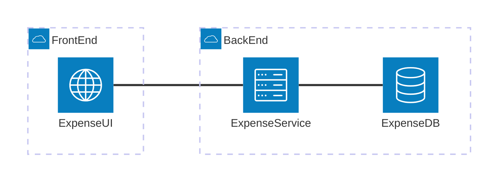

# Simple Expenses App
* Expenses list backend API written in C# using Clean Architecture
* Expenses list frontend written in Angular
* Support all CRUD operations

## High level architecture

### Components
* __Expense UI:__ Angular frontend, hosted as a static website in Azure
* __Expense Service:__ .Net Web API, hosted as an App Service Web App in Azure
* __Expense DB:__ Azure SQL Database

## Incremental development plan
* __Version 1.0:__ The goal is to get a quick and dirty working application with tThe most simplistic components having.
   * straight-forward data access using Dapper ORM
   * Read-only list of expenses displayed
   * no unit tests
   * no deployment scripts
   * code organized in classes but not as Clean Architecture
    _Current status: IN PROGRESS_
* __Version 1.1:__ The goal is to re-write the backend using Entity Framework, but no functional changes
 _Current status: NOT STARTED_
* __Version 1.2:__ Reorganise backend code to Clean Architecture
 _Current status: NOT STARTED_
* __Version 2.0:__ Full CRUD operations
 _Current status: NOT STARTED_
* __Version 2.1:__ Unit tests, but no more functionality
 _Current status: NOT STARTED_
* __Version 2.2:__ Build pipelines using YAML, but no changes in functionality
 _Current status: NOT STARTED_
* __Version 2.3:__ Docker support, but no changes in functionality
 _Current status: NOT STARTED_
* __Version 2.4:__ Bicep/ Terraform deployment scripts
 _Current status: NOT STARTED_
* __Version N:__ Azure Vision integration to read receipts

